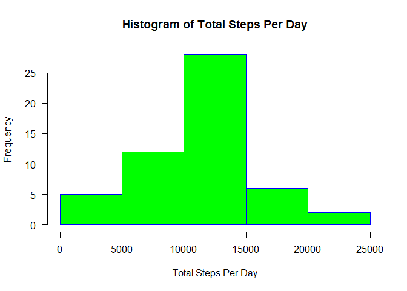
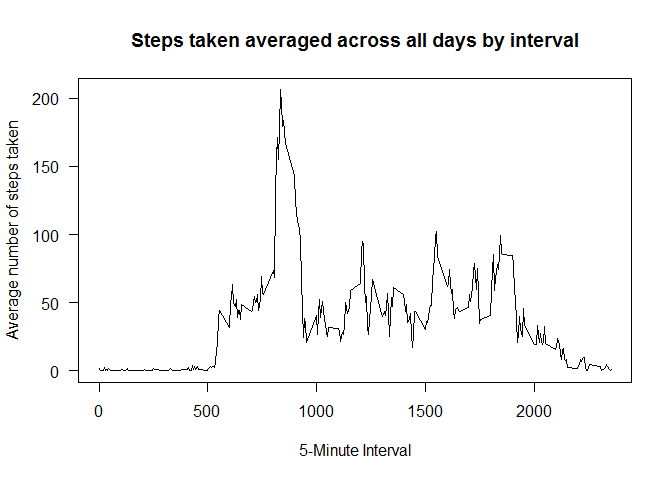
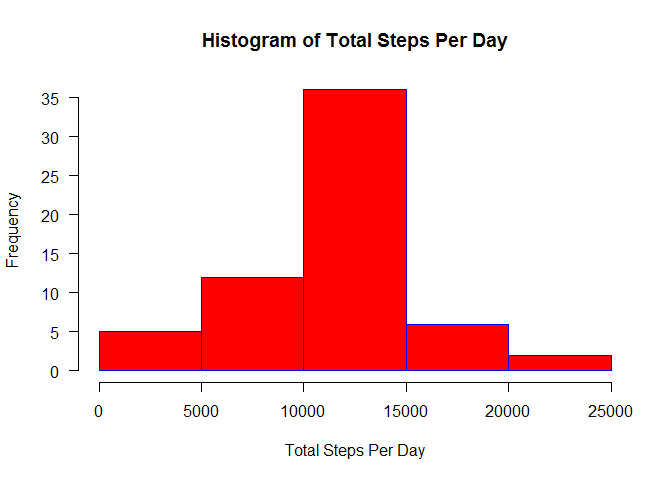

# Reproducible Research: Peer Assessment 1

# Reproducible Research Course Project 1

The data for this assignment was downloaded from the course web site:

Dataset: [Activity monitoring data](https://d396qusza40orc.cloudfront.net/repdata%2Fdata%2Factivity.zip)
The variables included in this dataset are:

steps: Number of steps taking in a 5-minute interval (missing values are coded as NA)
date: The date on which the measurement was taken in YYYY-MM-DD format
interval: Identifier for the 5-minute interval in which measurement was taken
The dataset is stored in a comma-separated-value (CSV) file and there are a total of 17,568 observations in this dataset.

### Note
For the assignment, the input file was unzip and placed into the project folder directory

## Loading and preprocessing the data
1. Load the data (i.e. read.csv())


```r
dt <- read.csv( "activity.csv" )
```

2. Process/transform the data (if necessary) into a format suitable for your analysis

> Not performed 

## What is mean total number of steps taken per day?

Calculate the total number of steps taken per day


```r
dtSteps <- aggregate( steps ~ date, dt, FUN=sum, na.action=na.omit )
```

Make a histogram of the total number of steps taken each day


```r
hist(dtSteps$steps, main="Histogram of Total Steps Per Day", xlab="Total Steps Per Day", border="blue", col="green", las=1, breaks=5 )
```



Calculate and report the mean and median of the total number of steps taken per day

```r
summary(dtSteps)
```

```
##          date        steps      
##  2012-10-02: 1   Min.   :   41  
##  2012-10-03: 1   1st Qu.: 8841  
##  2012-10-04: 1   Median :10765  
##  2012-10-05: 1   Mean   :10766  
##  2012-10-06: 1   3rd Qu.:13294  
##  2012-10-07: 1   Max.   :21194  
##  (Other)   :47
```

## What is the average daily activity pattern?

Make a time series plot (i.e. type = "l") of the 5-minute interval (x-axis) and the average number of steps taken, averaged across all days (y-axis)


```r
dtStepsAV <- aggregate( steps ~ interval, dt, FUN=mean, na.action=na.omit )
plot(dtStepsAV$interval, dtStepsAV$steps, type='l', main="Steps taken averaged across all days by interval", xlab="5-Minute Interval", ylab="Average number of steps taken",las=1 )
```



Which 5-minute interval, on average across all the days in the dataset, contains the maximum number of steps?


```r
dtStepsAV[which( dtStepsAV$steps == max( dtStepsAV$steps)), ]
```

```
##     interval    steps
## 104      835 206.1698
```

## Imputing missing values

Calculate and report the total number of missing values in the dataset (i.e. the total number of rows with NAs)


```r
nrow(dt) - nrow(na.omit(dt))
```

```
## [1] 2304
```

Create a new imputed values by filling in all of the missing values in the dataset with the mean of the interval previously calculated above within dtStepsAV.


```r
dtImpute <- dt
for (i in 1:nrow(dtImpute)) {
    if (is.na(dtImpute[i, ]$steps)) {
        dtImpute[i, ]$steps <- dtStepsAV[ dtStepsAV$interval == dtImpute[i, ]$interval, ]$steps
    }
}
```

Make a histogram of the total number of steps taken each day and Calculate and report the mean and median total number of steps taken per day.

Calculate the total number of steps taken per day

```r
dtSteps2 <- aggregate( steps ~ date, dtImpute, FUN=sum )
```

Make a histogram of the total number of steps taken each day

```r
hist(dtSteps2$steps, main="Histogram of Total Steps Per Day", xlab="Total Steps Per Day", border="blue", col="red", las=1, breaks=5 )
```



Calculate and report the mean and median of the total number of steps taken per day

```r
summary(dtSteps2)
```

```
##          date        steps      
##  2012-10-01: 1   Min.   :   41  
##  2012-10-02: 1   1st Qu.: 9819  
##  2012-10-03: 1   Median :10766  
##  2012-10-04: 1   Mean   :10766  
##  2012-10-05: 1   3rd Qu.:12811  
##  2012-10-06: 1   Max.   :21194  
##  (Other)   :55
```


## Are there differences in activity patterns between weekdays and weekends?

Weekdays() function is used to assign the day of week. This is used to assign 'weekend' (for Saturday & Sunday) or 'weekday' for the rest

```r
dtWeekdays <- dtImpute
dtWeekdays$day <- weekdays( as.Date( dtWeekdays$date ) )

for (i in 1:nrow( dtWeekdays ) ) {
  if ( dtWeekdays$day[ i ]  %in% c('Saturday','Sunday') ) {
      dtWeekdays$dayindicator[i] <- "weekend"
  }
  else {
      dtWeekdays$dayindicator[i] <- "weekday"
  }
}
```

Make a panel plot containing a time series plot (i.e. type = "l") of the 5-minute interval (x-axis) and the average number of steps taken, averaged across all weekday days or weekend days (y-axis). Lattice is used for plot

```r
dtStepsAV2 <- aggregate( steps ~ interval + dayindicator, dtWeekdays, FUN=mean )
library(lattice)
xyplot(steps ~ interval | dayindicator , data = dtStepsAV2, type='l', layout=c( 1, 2 ) )
```


